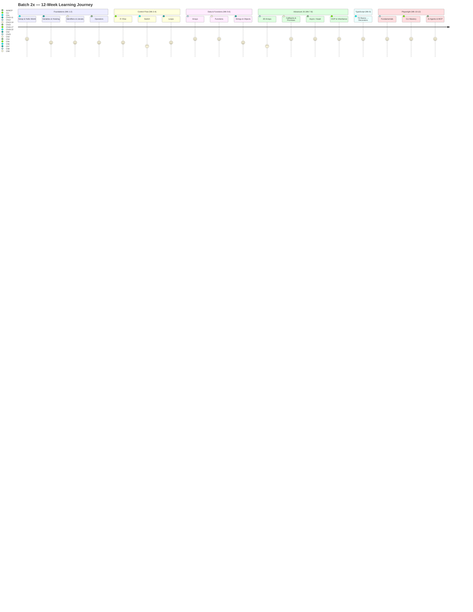
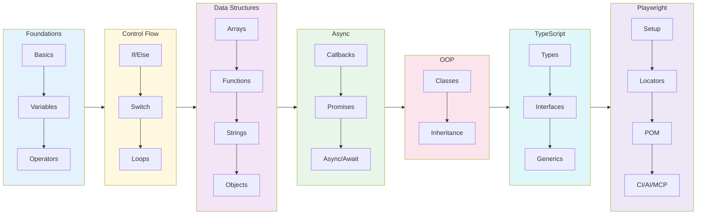
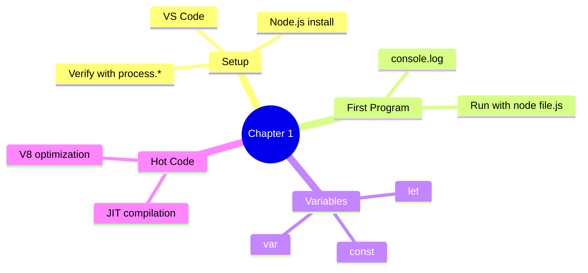
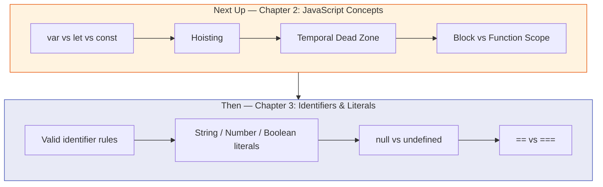
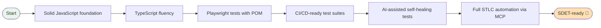
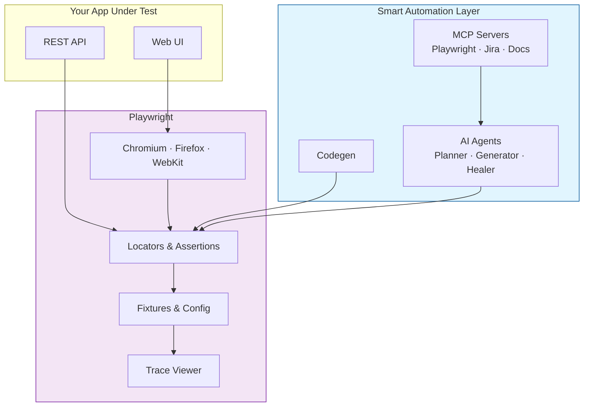

# Learn Playwright Batch 2x

<div align="center">


**The official course repository for Batch 2x — JavaScript, TypeScript, and Playwright for SDETs**

*Zero to automation hero — JavaScript fundamentals → TypeScript → Playwright → AI Agents & MCP*

[Quick Start](#-quick-start) · [Curriculum](#-curriculum-roadmap) · [Weekly Plan](#-weekly-plan) · [What You'll Build](#-what-youll-build) · [Resources](#-resources)

</div>

---

## Welcome to Batch 2x

This repository is your **week-by-week course companion** for the LearnPlaywright Batch 2x cohort by [The Testing Academy](https://thetestingacademy.com). Code shown in lectures lands here so you can read it, run it, and practice on it.

> Content gets added **as we progress through the batch** — so check back after every class.

### What you'll learn

- **JavaScript Fundamentals** — variables, control flow, arrays, functions, OOP, async
- **TypeScript** — types, interfaces, enums, generics, access modifiers, decorators
- **Playwright** — setup, locators, assertions, fixtures, POM, debugging, CI
- **Modern QA** — Playwright CLI, AI Agents, and MCP for full STLC automation

---

## 🗺️ Curriculum Roadmap

```mermaid
graph TB
    subgraph root["LearnPlaywrightBatch2x"]
        direction TB

        subgraph js["📘 JavaScript (Weeks 1–6)"]
            ch1["Ch 1: Basics ✅"]
            ch2["Ch 2: JS Concepts"]
            ch3["Ch 3: Identifiers & Literals"]
            ch4["Ch 4: Operators"]
            ch5["Ch 5: If / Else"]
            ch6["Ch 6: Switch"]
            ch7["Ch 7: Loops"]
            ch8["Ch 8: Arrays"]
            ch9["Ch 9: Functions"]
            ch10["Ch 10: Strings"]
        end

        subgraph adv["⚙️ Advanced JS (Weeks 7–8)"]
            ch11["Ch 11: Objects"]
            ch12["Ch 12: 2D Arrays"]
            ch13["Ch 13: Callbacks"]
            ch14["Ch 14: Promises"]
            ch15["Ch 15: Async / Await"]
            ch16["Ch 16: OOP - Classes"]
            ch17["Ch 17: Inheritance"]
        end

        subgraph ts["🟦 TypeScript (Week 9)"]
            ch18["Ch 18: TS Fundamentals"]
            ch19["Ch 19: Interfaces"]
            ch20["Ch 20: Enums"]
            ch21["Ch 21: Generics"]
            ch22["Ch 22: Access Modifiers & Decorators"]
        end

        subgraph pw["🎭 Playwright (Weeks 10–12)"]
            ch23["Ch 23: PW Fundamentals"]
            cli["Lecture: Playwright CLI"]
            ai["Lecture: AI Agents"]
            mcp["Lecture: MCP Protocol"]
        end

        subgraph extras["🎯 Bonus"]
            tasks["Interview Coding Questions"]
            tests["Real-world Test Projects"]
        end
    end

    js --> adv --> ts --> pw --> extras

    style js fill:#e1f5fe,stroke:#01579b
    style adv fill:#fff3e0,stroke:#e65100
    style ts fill:#e0f7fa,stroke:#00838f
    style pw fill:#f3e5f5,stroke:#7b1fa2
    style extras fill:#e8f5e9,stroke:#2e7d32
```



---

## 📚 Current Folder Structure

```
LearnPlaywrightBatch2x/
├── chapter_01_Basics/                  ✅ Hello World, env setup, hot code
│   ├── 01_Basics.js                    # First console.log program
│   ├── 02_JS.js                        # Variables & a simple loop
│   ├── 03_JS_Verify_Setup.js           # Verify Node.js/OS/arch
│   └── 04_HotCode.js                   # JIT & "hot" code paths
│
├── chapter_02_Javascript_Concepts/     🚧 var / let / const & hoisting
├── chapter_03_Identifier_Literals/     🚧 Identifiers, literals, equality
│
└── README.md                           👋 You are here
```

> **Legend:** ✅ Done · 🚧 Coming soon

---

## 🚀 Quick Start

### Prerequisites

| Tool | Version | Purpose |
|------|---------|---------|
| **Node.js** | 18+ (LTS recommended) | Runs all `.js` files |
| **npm** | Bundled with Node | Package manager |
| **VS Code** | Latest | Recommended editor |
| **Git** | Latest | Clone the repo |

### Setup

```bash
# 1. Clone the repository
git clone https://github.com/PramodDutta/LearnPlaywrightBatch2x.git
cd LearnPlaywrightBatch2x

# 2. Verify your setup
node chapter_01_Basics/03_JS_Verify_Setup.js

# 3. Run your first JS program
node chapter_01_Basics/01_Basics.js
```

### Verify it works

```bash
$ node chapter_01_Basics/01_Basics.js
Hello The Testing Academy
```

If you see that line, you're all set! 🎉

---

## 📅 Weekly Plan



| Week | Topic | Chapters | Outcome |
|:----:|-------|---------:|---------|
| 1 | JS Basics & Setup | Ch 1 | Run Node, write first JS |
| 2 | Variables & Hoisting | Ch 2 | Master `var`/`let`/`const` |
| 3 | Identifiers, Literals, Operators | Ch 3–4 | Read/write any expression |
| 4 | Control Flow | Ch 5–7 | If/else, switch, loops |
| 5 | Arrays & Functions | Ch 8–9 | Manipulate data confidently |
| 6 | Strings & Objects | Ch 10–11 | Use JS data structures |
| 7 | Async (Callbacks → Promises) | Ch 12–14 | Handle async work |
| 8 | Async/Await + OOP | Ch 15–17 | Modern async, classes |
| 9 | TypeScript | Ch 18–22 | Type-safe automation code |
| 10 | Playwright Fundamentals | Ch 23 | First passing test |
| 11 | Playwright CLI Mastery | CLI Lecture | Codegen, debug, trace |
| 12 | AI Agents + MCP | AI/MCP Lectures | Self-healing, full STLC |

---

## 🧭 Learning Flow



---

## 📖 What's in Chapter 1 (Available Now)

### Files

| File | Topic | What you'll learn |
|------|-------|-------------------|
| `01_Basics.js` | Hello World | First `console.log`, declaring a variable |
| `02_JS.js` | Variables & Loops | Re-declaring with `let`, calling functions inside loops |
| `03_JS_Verify_Setup.js` | Environment Check | `process.platform`, `process.arch`, `process.version` |
| `04_HotCode.js` | Hot Code Paths | How V8 optimizes frequently-called functions |

### Key Concepts



### Run them

```bash
node chapter_01_Basics/01_Basics.js          # → "Hello The Testing Academy"
node chapter_01_Basics/02_JS.js              # → counts to 100000 calling print()
node chapter_01_Basics/03_JS_Verify_Setup.js # → prints platform / arch / node version
node chapter_01_Basics/04_HotCode.js         # → triggers V8 hot-path optimization
```

---

## 🔭 What's Coming Next



---

## 🎯 What You'll Build (by the end)



By graduation you'll have:

- ✅ A complete JavaScript + TypeScript portfolio
- ✅ Production-grade Playwright test suites with the Page Object Model
- ✅ Hands-on experience with **Playwright CLI**, **codegen**, **trace viewer**
- ✅ Real projects using **AI agents** (Planner / Generator / Healer)
- ✅ End-to-end **MCP-driven STLC automation** (Playwright + Jira + reports)
- ✅ Interview prep — coding questions + Q&A banks

---

## 🧩 How Playwright Fits In (Big Picture)



---

## 🛠️ Useful Commands (You'll Use These Soon)

```bash
# JavaScript
node <file.js>                           # Run any chapter file

# TypeScript (Week 9+)
npx tsc <file.ts>                        # Compile TS → JS
npx ts-node <file.ts>                    # Run TS directly

# Playwright (Week 10+)
npm init playwright@latest               # Scaffold Playwright project
npx playwright test                      # Run all tests
npx playwright test --ui                 # Interactive UI mode
npx playwright test --debug              # Debug with inspector
npx playwright codegen <url>             # Record a test
npx playwright show-report               # Open HTML report
npx playwright show-trace <trace.zip>    # Open trace viewer
```

---

## 📘 Recommended Study Habit

| Day | Activity |
|-----|----------|
| **Class day** | Watch the live class, take notes |
| **Day +1** | Re-run every example from the chapter folder |
| **Day +2** | Solve 2–3 interview-style problems on the topic |
| **Day +3** | Build a tiny project applying the concept |
| **Weekend** | Recap the week — re-read code, ask doubts in the group |

> **Rule of thumb:** Don't move to the next chapter until you can explain the previous one out loud.

---

## 🔗 Resources

- 📺 [The Testing Academy YouTube](https://youtube.com/@TheTestingAcademy)
- 🌐 [thetestingacademy.com](https://thetestingacademy.com)
- 📚 [Playwright Docs](https://playwright.dev/docs/intro)
- 📚 [TypeScript Handbook](https://www.typescriptlang.org/docs/handbook/intro.html)
- 📦 [Reference Repo — Batch 1](https://github.com/PramodDutta/LearningPlaywrightBatch)

---

## 🙋 Project Info

| | |
|---|---|
| **Author** | Pramod Dutta |
| **Organization** | The Testing Academy |
| **Batch** | 2x (in progress) |
| **Stack** | JavaScript · TypeScript · Playwright · Node 18+ |

---

<div align="center">

**Happy learning, future SDETs! 🚀**

*Code with intent. Test with confidence. Automate with joy.*

— Pramod & The Testing Academy team

</div>